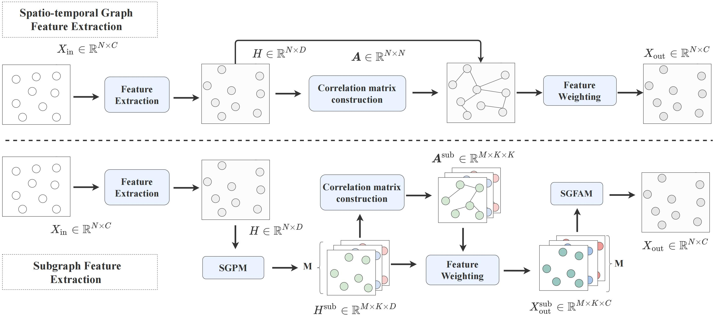

# Let's Group: A Plug-and-Play SubGraph Learning Method for Memory-Efficient Spatio-Temporal Graph Modeling

## Module  
The SubGraph Learning method is located in the `SGL module` folder.

## Model  
We have integrated the SubGraph Learning method into the code frameworks of models such as `DDGCRN-main` to ensure fair comparisons.

## Running the Model  
Please refer to the `README` file in each model framework for instructions on setting up the environment and running the models.

## How to Use the SGL Method  
We have embedded the parameters for the SGL method into the model's parameters:  
- In `DDGCRN-main`、`DGCNet-main` and `GMAN`, the related parameter settings are in the `config_file`.  
- In `STAEformer`, the related parameter settings are in `model/STAEformer.yaml`.  
- In `STWave`, the related parameter settings are in `baselines/STWave/PEMS0X.py`.
- In `DGCRN-main`, the settings are in `main.py`.

To disable the SGL method, set `use_subgraph` to `False`.  
The parameters `memory_node` and `topk` control the number of subgraphs and the number of nodes in each subgraph, respectively.

## Dataset
The relevant datasets can be downloaded from Google Drive:  
[Dataset Link](https://drive.google.com/file/d/1xEoy-mwHeql5Ew_mmdQMGn34019iI-4I/view?usp=sharing).

The files are named according to the corresponding models. To use a dataset, simply place the corresponding file in the appropriate model framework folder.  
For example:
- In `DDGCRN` and `DGCNet`, move the `data` folder from `data_DDGCRN_DGCNet` into the directory of each model.
